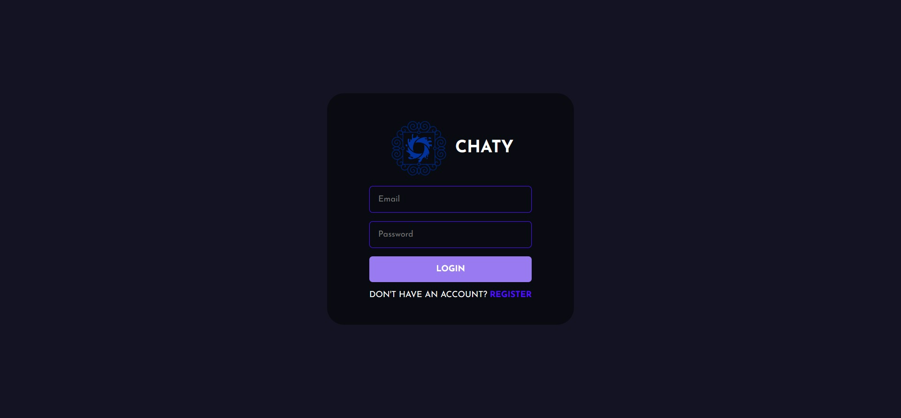
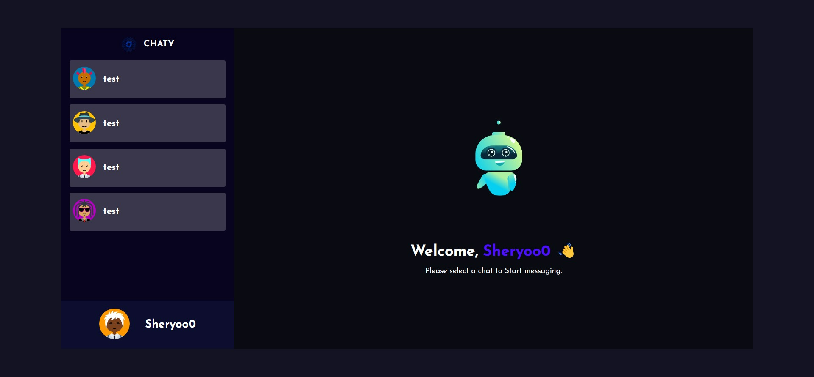

# Chaty - Chat Application 

### Real-time chat app using Socket.io and React





## Installation Guide

### Requirements
- [Node.js](https://nodejs.org/en/download)

It should be installed.

- [React](https://react.dev/learn)

You should have the basic knowledge to deal with code.

```shell
git clone https://github.com/Sheryoo/Full-chat-app.git
cd Full-chat-app
```
Now rename env files from .env.example to .env and add your *API_KEYS*
```shell
cd public
mv .env.example .env
cd ..
cd server
mv .env.example .env
cd ..
```

Now install the dependencies
```shell
cd server
yarn
cd ..
cd public
yarn
```
We are almost done, Now just start the development server.

For Frontend.
```shell
cd public
yarn start
```
For Backend.

Open another terminal in folder, Also make sure mongodb is running in background.
```shell
cd server
yarn start
```

Done! Now open localhost:3000 in your browser.
